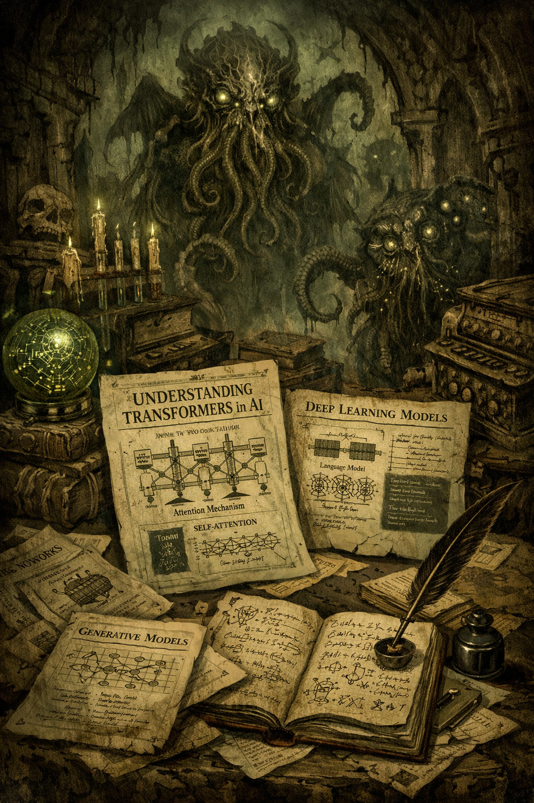

+++ { "kind": "split-image" }

## Welcome to AI-papers

Exploro e implemento papers de Inteligencia Artificial —desde Transformers hasta modelos generativos— traduciendo teoría compleja en código claro y funcional. Un viaje entre matemáticas, algoritmos y arquitectura moderna, donde cada paper desvela un fragmento del conocimiento profundo que impulsa la IA actual.

{button}`Documentation <https://github.com/toxfu/AI-papers>`